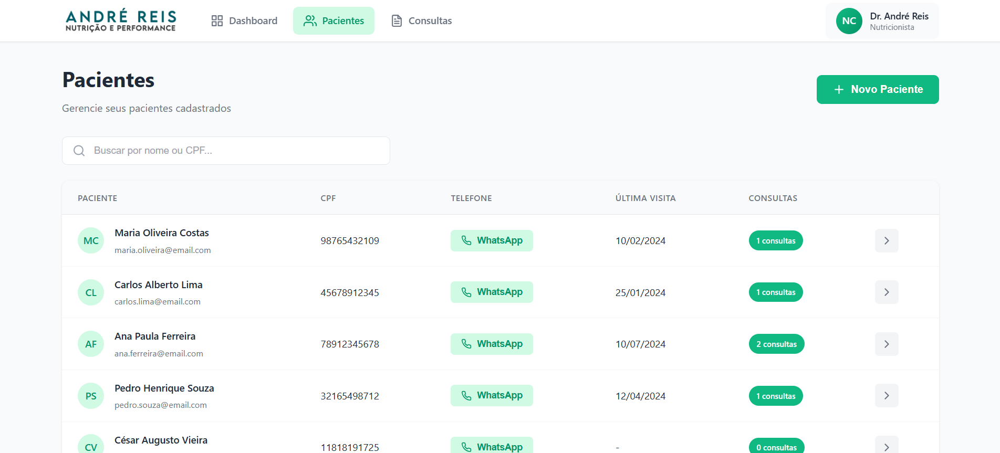
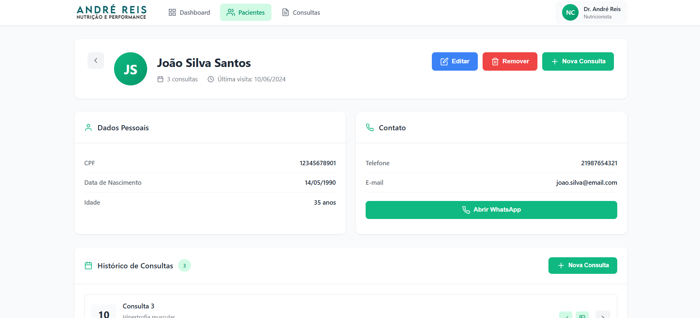
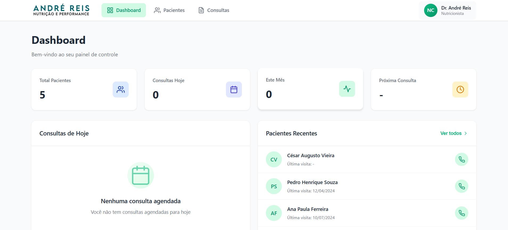

# Sistema de Gestão de Pacientes e Consultas

Sistema web para controle de pacientes e agendamento de consultas, oferecendo interface intuitiva e responsiva para profissionais da saúde gerenciarem seus atendimentos de forma eficiente.

## ✨ Funcionalidades

### Gestão de Pacientes
- Cadastro completo de pacientes com informações pessoais e contato
- Listagem com busca e filtros avançados
- Visualização detalhada do perfil do paciente
- Edição e remoção de registros




### Gestão de Consultas
- Agendamento de consultas vinculadas a pacientes
- Visualização por data e horário
- Registro de objetivos e observações da consulta
- Histórico completo de consultas por paciente


### Dashboard
- Visão geral de estatísticas e métricas
- Consultas recentes
- Indicadores de atividade



## 🚀 Tecnologias Utilizadas

- **Angular 19** - Framework principal
- **TypeScript** - Linguagem de programação
- **SCSS** - Estilização
- **Standalone Components** - Arquitetura moderna do Angular
- **Signals** - Gerenciamento de estado reativo
- **RxJS** - Programação reativa

## 📦 Pré-requisitos

- Node.js 22.12.0 (conforme especificado no `.nvmrc`)
- npm ou yarn

## 🔧 Instalação

1. Clone o repositório:
```bash
git clone [url-do-repositorio]
cd [nome-do-projeto]
```

2. Instale as dependências:
```bash
npm install
```

3. Configure as variáveis de ambiente:
   - Edite `src/environments/environment.ts` para produção
   - Edite `src/environments/environment.development.ts` para desenvolvimento

4. Execute o projeto:
```bash
npm start
```

A aplicação estará disponível em `http://localhost:4200`

## 🏗️ Estrutura do Projeto

```
src/
├── app/
│   ├── components/         # Componentes reutilizáveis
│   │   ├── navbar/        # Barra de navegação
│   │   └── toast/         # Sistema de notificações
│   ├── pages/             # Páginas da aplicação
│   │   ├── dashboard/     # Dashboard principal
│   │   ├── pacientes/     # Módulo de pacientes
│   │   └── consultas/     # Módulo de consultas
│   ├── services/          # Serviços e comunicação com API
│   ├── models/            # Modelos de dados
│   ├── interceptors/      # Interceptadores HTTP
│   └── environments/      # Configurações de ambiente
└── public/                # Recursos estáticos
```

## 📱 Funcionalidades Técnicas

### Componentes Standalone
Todos os componentes utilizam a arquitetura standalone do Angular 19, eliminando a necessidade de NgModules.

### Gerenciamento de Estado
Utilização de Signals para gerenciamento reativo do estado da aplicação.

### Sistema de Notificações
Toast notifications customizado com animações e diferentes tipos (sucesso, erro, aviso, informação).

### Interceptador HTTP
Tratamento centralizado de erros HTTP com feedback visual ao usuário.

### Responsividade
Interface totalmente responsiva, adaptada para desktop, tablet e mobile.

## 🛠️ Scripts Disponíveis

```bash
npm start          # Inicia o servidor de desenvolvimento
npm run build      # Build para produção
npm test           # Executa os testes
npm run lint       # Verifica o código
```

## 🔗 Integração com Backend

Este frontend foi desenvolvido para se comunicar com uma API REST. Configure a URL base da API no arquivo de ambiente correspondente:

```typescript
export const environment = {
  production: false,
  apiUrl: 'http://localhost:8080/api'
};
```